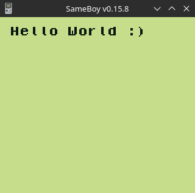

# GameBoy Example 01: Hello World



> Simple program that prints "Hello World" on the screen.

```
#include <stdio.h>

void main(void) {
    printf("Hello World :)\n");
}
```

Originally related article (in French): 
https://blog.flozz.fr/2019/09/18/developpement-gameboy-1bis-re-hello-world/