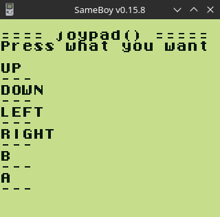

# GameBoy Example 02: Gamepad

The GameBoy has 8 buttons that our program can use to receive user input:

* `D-PAD` composed of 4 buttons `up`, `down`, `left`, `right`. It is most often used to move the character or an object, and to navigate the menus.
* `A` button, mainly used for primary actions (jump, accelerate, validate in a menu).
* `B` button, often assigned to secondary actions (pull, brake, cancel/go back in a menu).
* `START` button, usually used to pause the game or to display a menu.
* `SELECT` button, which is used, when used, to perform unusual actions, because it is difficult to access in the heat of the moment.

To use the gamepad, GBDK provides us with 3 functions via the `<gb/gb.h>` library:

* `waitpad()`
* `waitpadup()`
* `joypad()`

as well as a mask for each button of the gamepad:

| Mask     | Key input                     |
| ----     | ---------                     |
| J_UP     | `D-PAD` up button             |
| J_DOWN   | `D-PAD` down button           |
| J_LEFT   | left button of the `D-PAD`    |
| J_RIGHT  | right button of the `D-PAD`   |
| J_A      | button `A`                    |
| J_B      | button `B`                    |
| J_START  | `START` button                |
| J_SELECT | `SELECT` button               |

## The waitpad() function

The `waitpad()` function blocks program execution until the requested key(s) is pressed. It takes as a parameter the mask of the keys that interest us and returns the key(s) actually pressed.

> uint8_t waitpad(uint8_t mask)  

In the example below, we wait for the player to press the `START` key, so we pass the `J_START` mask as a function parameter:

```
#include <stdio.h> 
#include <gb/gb.h> 

int main(void) {  
    printf("Press START \n");
    waitpad(J_START);
    printf("START \n");
    return 0;
}
```

If we want to allow the player to press several keys, we must then merge the masks of the desired keys via the binary operation “or” (`|`). For example, to authorize pressing the `A` and `B` keys, you can write the following code:

```
#include <stdio.h> 
#include <gb/gb.h> 

int main(void) {  
    printf("Press A or B \n");
    waitpad(J_A | J_B);  
    printf("Good");
    return 0;
}
```

**NOTE**: We are obviously not limited to just two keys, we can listen to more, just merge as many key masks as necessary, for example `J_A | J_B | J_START | J_SELECT`.

The problem when listening to several keys is that you cannot immediately know which one has been pressed, since you move on to the rest of the program as soon as one (or more) of the keys have been pressed. Fortunately, the `waitpad()` function returns which keys were pressed.

This feedback takes the form of a number representing all the keys pressed. If it were only possible to press one key at a time, we could directly compare this number to the key mask (`key == J_START` for example). The problem is that in practice the user can press as many keys as they want simultaneously, which prevents us from simply making this comparison.

To know if a key was actually pressed, we need to apply its mask to the value returned by `waitpad()` via the binary “and” operator (`&`), and depending on the result, we will know whether or not the key was pressed. was supported.

For example, if we want to know if the `START` key has been pressed, we must apply the mask `J_START` to the number returned by `waitpad()`. If the result of the `& J_START` key operation is different from 0, the key was pressed. If, on the contrary, the result is equal to 0, the button was not pressed.

Here's a little example to clarify all that:

```
#include <stdio.h>
#include <stdint.h>
#include <gb/gb.h> 

int main(void) {  
    uint8_t key; 
    printf("Press LEFT or RIGHT! \n");
    key = waitpad(J_LEFT | J_RIGHT);    
    if (key & J_LEFT) {    
        printf("You pressed LEFT");
    } else if (key & J_RIGHT) {      
        printf("You pressed RIGHT");
    }
    return 0;
}
```

## The waitpadup() function

The `waitpadup()` function blocks the program until all gamepad keys have been released.

> void waitpadup(void)

Said like this, this function may seem a bit useless, but it is nevertheless very important when using `waitpadup()`.

Indeed, if you call the `waitpad()` function twice in a row, there is a good chance that both will “pass” at once (there will be no pause between the two calls).

This is explained by the fact that the `waitpad()` function immediately gives control back to the program if the requested button was already pressed when it was called... which will happen if the player has not had time to remove your finger from the button between the two calls (it's not very fast for a human compared to a microprocessor).

The following program illustrates the problem stated above and shows how to use `waitpadup()` to resolve it:

```
#include <stdio.h>
#include <stdint.h>
#include <gb/gb.h> 

int main(void) {  
    // Here, a single press of "A" will skip both calls to waitpad() 
    printf("Press A! \n");     
    waitpad(J_A);
    printf(">1st \n");
    waitpad(J_A);
    printf(">2nd \n");

    // Wait until all buttons are released 
    waitpadup ();     

    printf("Press One more time! \n");
    waitpad(J_A);
    printf(">3rd");
    return 0;
}
```

## The joypad() function

Unlike the previous two functions, `joypad()` does not block the program while waiting for the player to press a key: it simply returns the buttons that are currently pressed and immediately returns control.

> uint8_t joypad(void)

The example below contains an infinite loop that continually reads keys and displays in real time all those that are pressed. This is the example we implemented, you can `make` it and run with Sameboy Emulator:

```
#include <stdio.h>
#include <stdint.h>
#include <gb/gb.h>


void demo_joypad(void) {
    uint8_t prev_keys = 0;
    uint8_t keys = 0;

    printf("Press what you want\n\n");

    // Infinit loop to read keys
    while (1) {
        // Read currently pressed keys
        keys = joypad();

        // If nothing changed from previous iteration, we continue to next
        // iteration (to avoid displaying the same message again and again, we
        // print a new message only when something changed)
        if (keys == prev_keys) {
            continue;
        }

        // We display the pressed keys...
        if (keys > 0) {
            if (keys & J_UP) printf("UP ");
            if (keys & J_DOWN) printf("DOWN ");
            if (keys & J_LEFT) printf("LEFT ");
            if (keys & J_RIGHT) printf("RIGHT ");
            if (keys & J_SELECT) printf("SELECT ");
            if (keys & J_START) printf("START ");
            if (keys & J_A) printf("A ");
            if (keys & J_B) printf("B ");
            printf("\n");

            // ... or "-" if no key is pressed.
        } else {
            printf("---\n");
        }

        // We keep the pressed keys
        prev_keys = keys;
    }
}

int main(void) {
    printf("\n==== joypad() =====\n");

    demo_joypad();
    return 0;
}
```

Here is the screenshot of the example above, running into Sameboy Emulator.



## When to use which function?

The question we might ask is in which case it is appropriate to use the `waitpad()` / `waitpadup()` pair and in which case it is preferable to use `joypad()`. The answer to this question is quite simple:

* The `waitpad()` and `waitpadup()` functions are very practical to use when interactivity is limited, for example on a start screen, in a menu or in a very simple puzzle game. However, they are unusable in a platform game or even in a game like Tetris: given that these functions block the execution of the program, it is not possible to do anything else during this time, like bring down the tetromino in the case of Tetris.

The `joypad()` function is ideal for use in the main loop of a game when something other than just waiting for user actions needs to happen.