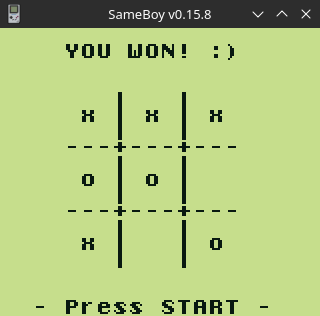

# GameBoy Example 03: Tic Tac Toe

> This text is based on [https://blog.flozz.fr/2018/10/29/developpement-gameboy-3-projet-1-tic-tac-toe/](https://blog.flozz.fr/2018/10/29/developpement-gameboy-3-projet-1-tic-tac-toe/)

The GameBoy's display in text mode is implemented by <gb/console.h> library. In text mode, the GameBoy screen can be summarized as a `20×18` character terminal. The first character at the top left has coordinates `(x,y) = (0, 0)`, and the last character at the bottom right `(x,y) = (19, 17)`. Therefore, its possible to display 360 characters on the screen, which should be enough for our little game:


<pre>
            (0,0)
                +--+--+--+--+--+--+--+--+--+--+--+--+--+--+--+--+--+--+
                |0 |1 |2 |3 |4 |5 |6 |7 |8 |9 |..|..|..|..|..|..|..|..|
                +--+--+--+--+--+--+--+--+--+--+--+--+--+--+--+--+--+--+
                |..|..|..|..|..|..|..|..|..|..|..|..|..|..|..|..|..|..|
                +--+--+--+--+--+--+--+--+--+--+--+--+--+--+--+--+--+--+
                |..|..|..|..|..|..|..|..|..|..|..|..|..|..|..|..|..|..|
                +--+--+--+--+--+--+--+--+--+--+--+--+--+--+--+--+--+--+
                |..|..|..|..|..|..|..|..|..|..|..|..|..|..|..|..|..|..|
                +--+--+--+--+--+--+--+--+--+--+--+--+--+--+--+--+--+--+
                |..|..|..|..|..|..|..|..|..|..|..|..|..|..|..|..|..|..|
                +--+--+--+--+--+--+--+--+--+--+--+--+--+--+--+--+--+--+
                |..|..|..|..|..|..|..|..|..|..|..|..|..|..|..|..|..|..|
                +--+--+--+--+--+--+--+--+--+--+--+--+--+--+--+--+--+--+
                |..|..|..|..|..|..|..|..|..|..|..|..|..|..|..|..|..|..|
                +--+--+--+--+--+--+--+--+--+--+--+--+--+--+--+--+--+--+
                |..|..|..|..|..|..|..|..|..|..|..|..|..|..|..|..|..|..|
                +--+--+--+--+--+--+--+--+--+--+--+--+--+--+--+--+--+--+
                |..|..|..|..|..|..|..|..|..|..|..|..|..|..|..|..|..|..|
                +--+--+--+--+--+--+--+--+--+--+--+--+--+--+--+--+--+--+
                |..|..|..|..|..|..|..|..|..|..|..|..|..|..|..|..|..|..|
                +--+--+--+--+--+--+--+--+--+--+--+--+--+--+--+--+--+--+
                |..|..|..|..|..|..|..|..|..|..|..|..|..|..|..|..|..|..|
                +--+--+--+--+--+--+--+--+--+--+--+--+--+--+--+--+--+--+
                |..|..|..|..|..|..|..|..|..|..|..|..|..|..|..|..|..|..|
                +--+--+--+--+--+--+--+--+--+--+--+--+--+--+--+--+--+--+
                |..|..|..|..|..|..|..|..|..|..|..|..|..|..|..|..|..|..|
                +--+--+--+--+--+--+--+--+--+--+--+--+--+--+--+--+--+--+
                |..|..|..|..|..|..|..|..|..|..|..|..|..|..|..|..|..|..|
                +--+--+--+--+--+--+--+--+--+--+--+--+--+--+--+--+--+--+
                |..|..|..|..|..|..|..|..|..|..|..|..|..|..|..|..|..|..|
                +--+--+--+--+--+--+--+--+--+--+--+--+--+--+--+--+--+--+
                |..|..|..|..|..|..|..|..|..|..|..|..|..|..|..|..|..|..|
                +--+--+--+--+--+--+--+--+--+--+--+--+--+--+--+--+--+--+
                |..|..|..|..|..|..|..|..|..|..|..|..|..|..|..|..|..|..|
                +--+--+--+--+--+--+--+--+--+--+--+--+--+--+--+--+--+--+
                |..|..|..|..|..|..|..|..|..|..|..|..|..|..|..|..|..|..|
                +--+--+--+--+--+--+--+--+--+--+--+--+--+--+--+--+--+--+
                |..|..|..|..|..|..|..|..|..|..|..|..|..|..|..|..|..|..|
                +--+--+--+--+--+--+--+--+--+--+--+--+--+--+--+--+--+--+
                |..|..|..|..|..|..|..|..|..|..|..|..|..|..|..|..|..| x| = 359
                +--+--+--+--+--+--+--+--+--+--+--+--+--+--+--+--+--+--+
                                                                    (19,17)
</pre>

## The library `<gb/console.h>`

GBDK-2020 provides some very practical libraries, among them is `<gb/console.h>` which provides some functions to manage the display of the GameBoy in text mode, which can be combined in addition to the `printf()` function. Here is the list of functions provided:

* `void gotoxy(uint8_t x, uint8_t y)`: allows you to move the console cursor to the given coordinates
* `uint8_t posx(void)`: returns the current x coordinate of the cursor
* `uint8_t posy(void)`: returns the current y coordinate of the cursor
* `void setchar(char c)`: displays the given character at the current cursor position. This function does not modify the position of the cursor and unlike `printf()`, the characters are not interpreted, which means that `\n` will not have any particular behavior. 

No need to put an example of their use, lets test the ones needed directly in the project code.

## Game development - Step 1: Title Screen

Every game starts with something easy: display a title screen. The program will run as follows:

1. Clear everything on the screen,
2. Show our title screen
3. Wait for the player to press START and release the button

We will place all of this in a dedicated function rather than in `main()`, calling this function `title_screen()`. Here is the current state of this function, implemented on `title_screen.c`:

```
#include <stdio.h>
#include <gbdk/console.h>
#include <gbdk/platform.h>
#include "helpers.h"

void title_screen(void) {
    clear_screen();
    gotoxy(4, 5);
    printf("Tic Tac Toe");
    gotoxy(3, 15);
    printf("- Press START -");
    waitpad(J_START);
    waitpadup();
}
```

In the `main()` function, notice included the call to the `title_screen()` function inside an infinite loop. Without it, the program would have ended immediately after displaying the title screen. At this didn't really makes difference, but when the gae is complete implemented, the player will be able to loop between the game phase and the display of the title screen.

Inside `title_screen()` function, no particular surprise, except for one detail: there is no function to clear the screen. To fullfil this need, a function were implemented and is listed below:

```
void clear_screen(void) {
    uint8_t x;
    uint8_t y = ROWS;
    while (y) {
        y -= 1;
        x = COLS;
        while (x) {
            x -= 1;
            gotoxy(x, y);
            setchar(' ');
        }
    }
}
```

## Game development - Step 2: Show the Board

Now that a title screen is in place, lets work on displaying the game screen, only the static parts (those which won't change during the part). Therefore, needs to display a grid of `3x3` squares and some peripheral information, such as the title of the game and a legend which indicates which symbol is used to represent the player (arbitrarily chose that it would be `x`) and which symbol is used for computer (in this case `O`).

Nothing really surprising here, it's the same thing as for the title screen, except that the user is not asked to press a key. The algorithm therefore boils down to:

1. Clear the screen
2. Then “draw” the board

Which gives us the following code:

```
void game_draw_board(void) {
    clear_screen();
    gotoxy(4, 1);
    printf("Tic Tac Toe");
    gotoxy(1, 17);
    printf("X You - O Computer");
    gotoxy(0, 4);
    printf("       |   |   \n");
    printf("       |   |   \n");
    printf("       |   |   \n");
    printf("    ---+---+---\n");
    printf("       |   |   \n");
    printf("       |   |   \n");
    printf("       |   |   \n");
    printf("    ---+---+---\n");
    printf("       |   |   \n");
    printf("       |   |   \n");
    printf("       |   |   \n");
}
```

## Game development - Step 3: Game Status

Lets now add code to maintain the state of the game. We currently need to record the state of the 9 squares (`3×3` squares) which make up the game grid. We can store this information in a table of 9 squares which we will declare directly at the top of the file (global variable):

> uint8_t GAME_BOARD [9]; // (3×3 boxes)   

Each of the 9 boxes in our table can be in one of the following 3 states:

* either the box is empty,
* either it contains the player's pawn,
* or it contains the computer piece.

 We have a one-dimensional table to store the state of our game, but the grid displayed to the player is in 2 dimensions (and all the logic of our game will be based on this two-dimensional vision of the grid). We will therefore need to perform a small calculation to convert the coordinates of the 2D grid to a 1D coordinate (an index) for our table. The formula for going from 2D coordinates ( x,y ) to index ( i ) of the array is:

> i = y × GRID_WIDTH + x

We can therefore write the following function in order to no longer worry about this detail later:

```
#define GAME_BOARD_SIZE   3

uint8_t coord_2d_to_1d(uint8_t x, uint8_t y) {
    return y * GAME_BOARD_SIZE + x;
}
```

Since our table is not initialized (and we have to reset it for each new game anyway), we will write a small function that takes care of that:

```
void game_init(void) {
    uint8_t i = GAME_BOARD_SIZE * GAME_BOARD_SIZE;

    // Clear board state
    while (i) {
        i -= 1;
        GAME_BOARD[i] = GAME_BOARD_CELL_EMPTY;
    }

    // Reset cursor position to center of the board
    GAME_CURSOR_X = GAME_BOARD_SIZE / 2;
    GAME_CURSOR_Y = GAME_BOARD_SIZE / 2;
}
```

Finally, we will create a game() function which will manage the entire progress of the game (initialization, display of the grid, gameplay loop and display of the result when the game is over). We will fulfill this function as we progress in the project but for the moment it looks like this:

```
void game(void) {
    uint8_t status;

    game_init();
    game_draw_board();

    while (1) {
        // Player turn
        game_player_play();
        game_draw_state();
        status = game_check_status();
        if (status != GAME_STATUS_PLAYING) {
            break;
        }
        // Computer turn
        game_computer_play();
        game_draw_state();
        status = game_check_status();
        if (status != GAME_STATUS_PLAYING) {
            break;
        }
    }

    game_draw_game_over(status);
}
```

We take advantage of this to adapt the content of the `main()` function:

```
#include <stdio.h>
#include "title_screen.h"
#include "game.h"

// Entry point of the program, loop between title screen and new games
void main(void) {
    printf(" ");  // First gotoxy() call does not works else...

    while (1) {
        title_screen();
        game();
    }
}
```

## Game development - Step 4: View Game Status

Now that we have displayed the game grid and we have something to record the state of the game, we need to write a function to display this state, that is to say display the players' pawns (the `X's` and the `O's`).

No particular difficulty in this function, so I won't go into too much detail: you just need to match the logical coordinates of the boxes (called `x` and `y` in the function below) to graphic coordinates (called `graph_x` and `graph_y`) on the screen. Once these graphic coordinates have been calculated, all you have to do is draw the correct symbol (`GAME_BOARD_CELL_EMPTY`, `GAME_BOARD_CELL_PLAYER` or `GAME_BOARD_CELL_COMPUTER`):

```
void game_draw_state(void) {
    uint8_t x;
    uint8_t y;
    uint8_t graph_x;
    uint8_t graph_y;
    uint8_t cell;

    for (cell = 0 ; cell < GAME_BOARD_SIZE * GAME_BOARD_SIZE ; cell += 1) {
        x = cell % GAME_BOARD_SIZE;
        y = cell / GAME_BOARD_SIZE;
        graph_x = GAME_BOARD_X + x * 3 + x + 1;
        graph_y = GAME_BOARD_Y + y * 3 + y + 1;
        gotoxy(graph_x, graph_y);
        setchar(GAME_BOARD[cell]);
    }
}
```

## Game development - Step 5: Show a cursor

In order for the player to place his pawns on the game board, he must be provided with a visual cue to enable him to select a square: we will therefore hatch the active square to enable him to find his way.

You will first have to start by adding some global variables to memorize the current coordinates of the cursor:

```
UINT8 GAME_CURSOR_X; 
UINT8 GAME_CURSOR_Y; 
```

We will then modify our initialization function so that it also initializes our two new variables:

```
void game_init(void) {
    uint8_t i = GAME_BOARD_SIZE * GAME_BOARD_SIZE;

    // Clear board state
    while (i) {
        i -= 1;
        GAME_BOARD[i] = GAME_BOARD_CELL_EMPTY;
    }

    // Reset cursor position to center of the board
    GAME_CURSOR_X = GAME_BOARD_SIZE / 2;
    GAME_CURSOR_Y = GAME_BOARD_SIZE / 2;
}
```

Finally, we code a small function allowing us to display the cursor:

```
void game_draw_cursor(uint8_t cursor_char) {
    uint8_t graph_x = GAME_BOARD_X + GAME_CURSOR_X * 4 + 1;
    uint8_t graph_y = GAME_BOARD_Y + GAME_CURSOR_Y * 4 + 1;
    uint8_t cx;
    uint8_t cy;
    for (cy = graph_y - 1 ; cy <= graph_y + 1 ; cy += 1) {
        for (cx = graph_x - 1 ; cx <= graph_x + 1 ; cx += 1) {
            if (cx == graph_x && cy == graph_y) {
                continue;
            }
            gotoxy(cx, cy);
            setchar(cursor_char);
        }
    }
}
```

Without going into details, this function has a small particularity: it takes as a parameter the character which will be used to hatch the box. We could very well have hardcoded this character, but the point of passing it as a parameter is to be able to reuse the same function to clear the cursor (by drawing the space character instead of the hatching).

## Game development - Step 6: Make the player play

After a few not very exciting steps, we will finally tackle the heart of the program: the game itself. We will start by developing a *gameplay* loop to allow the player to select a square and place their pawn there. The program for this loop will be as follows:

1. Show cursor
2. Wait for the player to press one of the `UP`, `DOWN`, `LEFT`, `RIGHT` keys to move the cursor, or the `A` key to place his pawn.
3. Clear cursor
4. React depending on the button pressed by the player:
    * If the player has pressed an arrow key, the cursor is moved, being careful not to move it outside the limits of the board
    * If the player pressed `A`, put his pawn in the box, if the latter is empty
5. Start again at step 1 until the player has placed his pawn.

Which gives us the following code:

```
void game_player_play(void) {
    uint8_t key;
    uint8_t cell;

    while (1) {
        game_draw_cursor('/');
        waitpadup();  // Avoids keys to be read twice
        key = waitpad(J_UP | J_DOWN | J_LEFT | J_RIGHT | J_A);
        game_clear_cursor();
        if (key & J_UP && GAME_CURSOR_Y != 0) {
            GAME_CURSOR_Y -= 1;
        }
        if (key & J_DOWN && GAME_CURSOR_Y != GAME_BOARD_SIZE - 1) {
            GAME_CURSOR_Y += 1;
        }
        if (key & J_LEFT && GAME_CURSOR_X != 0) {
            GAME_CURSOR_X -= 1;
        }
        if (key & J_RIGHT && GAME_CURSOR_X != GAME_BOARD_SIZE - 1) {
            GAME_CURSOR_X += 1;
        }
        if (key & J_A) {
            cell = coord_2d_to_1d(GAME_CURSOR_X, GAME_CURSOR_Y);
            if (GAME_BOARD[cell] == GAME_BOARD_CELL_EMPTY) {
                GAME_BOARD[cell] = GAME_BOARD_CELL_PLAYER;
                break;
            }
        }
    }
}
```

## Game development - Step 7: Play the computer

It's all well and good to allow the player to place pawns, but if he doesn't have an opponent, he will quickly get bored. We are not going to immediately develop the “AI” allowing the computer to play correctly; we will start by simply having him place his pawn in the first empty space available: this will allow us to finish developing the game before looking at this issue.

As for the player, we will create a function that we will call when we want to make the computer play:

```
void game_computer_play(void) {
    uint8_t x;
    uint8_t y;
    uint8_t cell;
    uint8_t player_score;
    uint8_t computer_score;
    int8_t lose_cell = -1;
    int8_t last_empty_cell = -1;

    // Check lines
    for (y = 0 ; y < GAME_BOARD_SIZE ; y += 1) {
        computer_score = 0;
        player_score = 0;
        for (x = 0 ; x < GAME_BOARD_SIZE ; x +=1) {
            cell = coord_2d_to_1d(x, y);
            switch (GAME_BOARD[cell]) {
                case GAME_BOARD_CELL_COMPUTER:
                    computer_score += 1;
                    break;
                case GAME_BOARD_CELL_PLAYER:
                    player_score += 1;
                    break;
                case GAME_BOARD_CELL_EMPTY:
                    last_empty_cell = cell;
                    break;
            }
        }
        // Direct win
        if (computer_score == 2 && player_score == 0) {
            GAME_BOARD[last_empty_cell] = GAME_BOARD_CELL_COMPUTER;
            return;
        }
        // Lose
        if (player_score == 2 && computer_score == 0) {
            lose_cell = last_empty_cell;
        }
    }

    // Check columns
    for (x = 0 ; x < GAME_BOARD_SIZE ; x += 1) {
        computer_score = 0;
        player_score = 0;
        for (y = 0 ; y < GAME_BOARD_SIZE ; y += 1) {
            cell = coord_2d_to_1d(x, y);
            switch (GAME_BOARD[cell]) {
                case GAME_BOARD_CELL_COMPUTER:
                    computer_score += 1;
                    break;
                case GAME_BOARD_CELL_PLAYER:
                    player_score += 1;
                    break;
                case GAME_BOARD_CELL_EMPTY:
                    last_empty_cell = cell;
                    break;
            }
        }
        // Direct win
        if (computer_score == 2 && player_score == 0) {
            GAME_BOARD[last_empty_cell] = GAME_BOARD_CELL_COMPUTER;
            return;
        }
        // Lose
        if (player_score == 2 && computer_score == 0) {
            lose_cell = last_empty_cell;
        }
    }

    // Check diagonal 1
    computer_score = 0;
    player_score = 0;
    for (x = 0 ; x < GAME_BOARD_SIZE ; x += 1) {
        cell = coord_2d_to_1d(x, x);
        switch (GAME_BOARD[cell]) {
            case GAME_BOARD_CELL_COMPUTER:
                computer_score += 1;
                break;
            case GAME_BOARD_CELL_PLAYER:
                player_score += 1;
                break;
            case GAME_BOARD_CELL_EMPTY:
                last_empty_cell = cell;
                break;
        }
    }

    // Direct win
    if (computer_score == 2 && player_score == 0) {
        GAME_BOARD[last_empty_cell] = GAME_BOARD_CELL_COMPUTER;
        return;
    }
    // Lose
    if (player_score == 2 && computer_score == 0) {
        lose_cell = last_empty_cell;
    }

    // Check diagonal 2
    computer_score = 0;
    player_score = 0;
    for (x = 0 ; x < GAME_BOARD_SIZE ; x += 1) {
        cell = coord_2d_to_1d(GAME_BOARD_SIZE - 1 - x, x);
        switch (GAME_BOARD[cell]) {
            case GAME_BOARD_CELL_COMPUTER:
                computer_score += 1;
                break;
            case GAME_BOARD_CELL_PLAYER:
                player_score += 1;
                break;
            case GAME_BOARD_CELL_EMPTY:
                last_empty_cell = cell;
                break;
        }
    }

    // Direct win
    if (computer_score == 2 && player_score == 0) {
        GAME_BOARD[last_empty_cell] = GAME_BOARD_CELL_COMPUTER;
        return;
    }
    // Lose
    if (player_score == 2 && computer_score == 0) {
        lose_cell = last_empty_cell;
    }

    cell = coord_2d_to_1d(1, 1);  // Middle cell
    if (lose_cell != -1) {
        GAME_BOARD[lose_cell] = GAME_BOARD_CELL_COMPUTER;
    } else if (GAME_BOARD[cell] == GAME_BOARD_CELL_EMPTY) {
        GAME_BOARD[cell] = GAME_BOARD_CELL_COMPUTER;
    } else {
        GAME_BOARD[last_empty_cell] = GAME_BOARD_CELL_COMPUTER;
    }
}
```

## Game development - Step 8: Check Game Status

Now that the player and the computer can play, we must be able to determine the end of the game. We are therefore going to write a function which will aim to analyze the board and which will determine which of the following four cases we find ourselves in:

* no one has won, but there are still empty squares: the game continues,
* the player has won (he has lined up 3 pawns),
* the player has lost (the computer has lined up 3 pawns),
* no one has won and there are no empty squares left: the game is over in a tie .

We will add four constants to our code which will correspond to each of the states above:

```
#define GAME_STATUS_PLAYING   0
#define GAME_STATUS_WON       1
#define GAME_STATUS_LOST      2
#define GAME_STATUS_EQUALITY  3
```

Then we will create a function which will return one of these constants according to its analysis of the game board. For the moment we will make it systematically return `GAME_STATUS_PLAYING` while we write a little logic in `game()``, we will come back modify it later to make it return the correct value:

```
uint8_t game_check_status(void) {
    uint8_t x;
    uint8_t y;
    uint8_t cell;
    uint8_t player_score_h;
    uint8_t player_score_v;
    uint8_t computer_score_h;
    uint8_t computer_score_v;
    uint8_t has_empty_cells = 0;

    // Check lines and columns
    for (y = 0 ; y < GAME_BOARD_SIZE ; y += 1) {
        player_score_h = 0;
        player_score_v = 0;
        computer_score_h = 0;
        computer_score_v = 0;
        for (x = 0 ; x < GAME_BOARD_SIZE ; x += 1) {
            // Lines
            cell = coord_2d_to_1d(x, y);
            switch (GAME_BOARD[cell]) {
                case GAME_BOARD_CELL_EMPTY:
                    has_empty_cells = 1;
                    break;
                case GAME_BOARD_CELL_PLAYER:
                    player_score_h += 1;
                    break;
                case GAME_BOARD_CELL_COMPUTER:
                    computer_score_h += 1;
                    break;
            }
            // Swap x, y to check column in the same loop
            cell = coord_2d_to_1d(y, x);
            switch (GAME_BOARD[cell]) {
                // NOTE: no need to check again for empty cells...
                case GAME_BOARD_CELL_PLAYER:
                    player_score_v += 1;
                    break;
                case GAME_BOARD_CELL_COMPUTER:
                    computer_score_v += 1;
                    break;
            }
        }

        if (player_score_h == GAME_BOARD_SIZE || player_score_v == GAME_BOARD_SIZE) {
            return GAME_STATUS_WON;
        }
        if (computer_score_h == GAME_BOARD_SIZE || computer_score_v == GAME_BOARD_SIZE) {
            return GAME_STATUS_LOST;
        }
    }

    // Check diagonal
    player_score_h = 0;
    player_score_v = 0;
    computer_score_h = 0;
    computer_score_v = 0;
    for (x = 0 ; x < GAME_BOARD_SIZE ; x += 1) {
        // Diagonal 1 (top-left to bottom-right)
        cell = coord_2d_to_1d(x, x);
        switch (GAME_BOARD[cell]) {
            case GAME_BOARD_CELL_PLAYER:
                player_score_h += 1;
                break;
            case GAME_BOARD_CELL_COMPUTER:
                computer_score_h += 1;
                break;
        }
        // Diagonal 2 (top-right to bottom-left)
        cell = coord_2d_to_1d(GAME_BOARD_SIZE - 1 - x, x);
        switch (GAME_BOARD[cell]) {
            case GAME_BOARD_CELL_PLAYER:
                player_score_v += 1;
                break;
            case GAME_BOARD_CELL_COMPUTER:
                computer_score_v += 1;
                break;
        }
    }

    if (player_score_h == GAME_BOARD_SIZE || player_score_v == GAME_BOARD_SIZE) {
        return GAME_STATUS_WON;
    }
    if (computer_score_h == GAME_BOARD_SIZE || computer_score_v == GAME_BOARD_SIZE) {
        return GAME_STATUS_LOST;
    }

    // Nobody won, let's see if we can continue to play
    if (has_empty_cells) {
        return GAME_STATUS_PLAYING;
    } else {
        return GAME_STATUS_EQUALITY;
    }
}
```

We now return to our `game_check_status()`` function. We will have him analyze the board in the following way:

1. we will go through the boxes line by line,
2. then the boxes column by column,
3. then the boxes of the first diagonal
4. and finally those of the other diagonal.

During each of these courses, we will count the player's pawns, the computer's pawns: if we find three pawns belonging to the same player during the course, that player will have won. We will also take the opportunity to note if we have any empty boxes left.

We will start by checking the lines, which gives us the following code: Then we do the same thing for the columns (we just reverse the loops on x and y , the rest of the code is identical: Then we do the same thing for the columns (we just reverse the loops on x and y , the rest of the code is identical: Then the other diagonal (this is the same code, the only change is at the line where we calculate the y coordinate . Finally, last step: when no one has won, you must look to see if there are any empty squares left in order to determine if the game continues or is over:

> **Note**: the code presented in this part can be greatly optimized: I actually went as simple as possible. I invite you to look at the final version of the project (link at the end of the article) to see how everything can be improved.

## Game development - Step 9: Show end-of-game screens

We only have one small detail left to adjust so that the game is playable from A to Z: display an end-of-game screen indicating who won (or if the players are tied ).

For these screens, we will just replace the title line ( Tic Tac Toe ) with the result (won, lost or tied ) and the bottom line with an invitation to press START . In this way, we leave the board displayed so that the player can see the result.

We will therefore create a small function responsible for modifying the display depending on the state we give it:

```
void game_draw_game_over(uint8_t status) {
    clear_line(1);
    switch (status) {
        case GAME_STATUS_WON:
            gotoxy(4, 1);
            printf("YOU WON! :)");
            break;
        case GAME_STATUS_LOST:
            gotoxy(4, 1);
            printf("YOU LOST! :(");
            break;
        case GAME_STATUS_EQUALITY:
            gotoxy(5, 1);
            printf("EQUALITY!");
            break;
    }
    clear_line(17);
    gotoxy(2, 17);
    printf("- Press START -");
    waitpad(J_START);
    waitpadup();
}
```

Nothing too complicated here, we will still notice the call to the clear_line() function that I created to avoid copying/pasting the same piece of code in two places... Here is the content of this function:

```
void clear_line(uint8_t y) {
    uint8_t x = COLS;
    while (x) {
        x -= 1;
        gotoxy(x, y);
        setchar(' ');
    }
}
```

All we have to do now is call our game_draw_game_over() function at the end of the game() function (outside the game loop): We will not forget to delete our waitpad (J_START); waitpadup() in the main loop of the main() function since they are no longer useful...

The game is now perfectly playable... even if the computer's "AI" is completely rotten...

## Game development - Step 10: Improve the computer's "AI"

Given that this article is already quite long and that writing a good AI could be the subject of an entire article, we will keep it simple: we will take the code of the game_check_status() function and adapt it a little . I'm not going to present everything in detail, but I'll show you what it looks like when analyzing the board line by line:

```
Already listed on top, needs to improve the text and remove this session
```

Now that the game is complete implemented, here is the screenshot:


