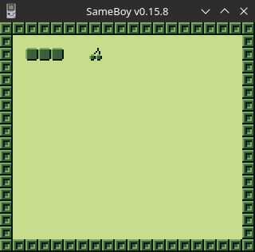

# GameBoy Example 04: Graphics 1

> Related article (in French): https://blog.flozz.fr/2018/11/12/developpement-gameboy-4-afficher-des-images/

Code games in text mode quickly limited us in our achievements, so we are finally going to get down to business: graphics. Since the GameBoy's video system is a fairly vast and central subject for game creation, we won't be able to cover it here. This first article will therefore be a more pratical introduction just a little more practical oriented, but you will still learn how to display an image at the end of the article. The companion code is a full implementation, some of the details will be covered here. 

The GameBoy screen is a screen with a definition of 160×144 pixels that can display 4 levels of “gray”. However, the pixels on the screen are not addressable. This means that you can't just change the color of a single pixel on the screen, you simply don't have access to it. The screen is divided into a grid of 20×18 “boxes” which we call tiles (or tiles in English). Each tile is an 8x8 pixel square.

To display an image, you will therefore have to cut it into small pieces which will be sent to the video memory of the console, and you will then have to explain to the GameBoy where to display each of these pieces. What is practical with this way of doing things is that we can reuse a tile in several places at the same time, which saves us memory.

The image displayed on the GameBoy screen comes from the composition of several layers:

* The Background layer is a layer composed of a grid of 32×32 tiles, that is larger than the screen, and is scrollable.
* The Window layer is displayed on top of the background layer, and is also composed of a grid of tiles. This layer is not scrollable but can be moved on the screen in order to only partially cover the background layer.
* Finally, there are the sprites, objects made up of 1 or 2 tiles (8×8 or 8×16 pixels) and can be positioned freely on the screen (pixel-wise, outside of any grid). Their use is, however, subject to a certain number of restrictions which we will discuss in another moment.

The GameBoy's video memory (VRAM) is essentially divided into 3 areas, each containing part of the information necessary for display:

* the area called Tile Data is used to store tile data, i.e. the bitmap images themselves.
* the Background Maps area is used to store the placement of tiles on the screen (for example, tile number 01 must be displayed in the box with coordinates (0, 0) ).
* finally the OAM area, for Object Attribute Memory (sometimes called Sprite Attribute Table), stores all the information linked to each sprite (what tile(s) it is composed of, its position, the color palette to use, etc).

We can therefore use a maximum of 255 different tiles on each layer, and if we use 255 tiles for the Background and Window layers , we only have 128 tiles usable for the sprites. The part that interests us the most at the moment is the range of video memory containing the Tiles Data, because it is with it that we will work most directly and which will give us the most constraints.

Please note you that you will have to forget the idea of ​​using text mode in a graphics program. So no more printf() function , <stdio.h> , <gb/console.h> libraries and so on, they won't go well with your program. To display text, the above-mentioned libraries store displayable characters in the form of tiles in video memory. The space is taken up by the characters and we can no longer add too many images from our own game.

## Simple example to show how to draw tiles on the GameBoy

To display tiles on the screen, we need to start by drawing them. Any image editor can do the trick. You must then convert this image into C code form, in a format specific to the GameBoy. As we will discuss this subject in the next article, I will give you the result directly below:

```
const uint8_t TILESET[] = {
    // Tile 00: Blank
    0x00, 0x00, 0x00, 0x00, 0x00, 0x00, 0x00, 0x00,
    0x00, 0x00, 0x00, 0x00, 0x00, 0x00, 0x00, 0x00,
    // Tile 01: Block
    0xff, 0x01, 0x81, 0x7f, 0xbd, 0x7f, 0xa5, 0x7b,
    0xa5, 0x7b, 0xbd, 0x63, 0x81, 0x7f, 0xff, 0xff,
    // Tile 02: Snake Body
    0x7e, 0x00, 0x81, 0x7f, 0x81, 0x7f, 0x81, 0x7f,
    0x81, 0x7f, 0x81, 0x7f, 0x81, 0x7f, 0x7e, 0x7e,
    // Tile 03: Boulder
    0x3c, 0x00, 0x54, 0x2a, 0xa3, 0x5f, 0xc1, 0x3f,
    0x83, 0x7f, 0xc5, 0x3f, 0x2a, 0x7e, 0x3c, 0x3c,
    // Tile 04: Cherry
    0x04, 0x04, 0x04, 0x04, 0x0a, 0x0a, 0x12, 0x12,
    0x66, 0x00, 0x99, 0x77, 0x99, 0x77, 0x66, 0x66,
};
```

We now need to load these tiles into video memory:

> set_bkg_data(0, 5, TILESET);

* The first parameter corresponds to the memory box from which we will place the tiles (here we set 0, so our first tile will be in box 0, the second in box 1, and so on).
* The second parameter is the number of tiles to copy into video memory. We therefore put 5 as it is the number of tiles present in our tileset.
* Finally, the last parameter is a pointer to the tile data.

All we have to do is tell the GameBoy where to display the tiles. If for example we want to represent a scene from the famous game Snake, we make a large table with the numbers of the tiles to display:

```
const uint8_t TILEMAP[] = {
    1, 1, 1, 1, 1, 1, 1, 1, 1, 1, 1, 1, 1, 1, 1, 1, 1, 1, 1, 1,
    1, 0, 0, 0, 0, 0, 0, 0, 0, 0, 0, 0, 0, 0, 0, 0, 0, 0, 0, 1,
    1, 0, 2, 2, 2, 0, 0, 4, 0, 0, 0, 0, 0, 0, 0, 0, 0, 0, 0, 1,
    1, 0, 0, 0, 0, 0, 0, 0, 0, 0, 0, 0, 0, 0, 0, 0, 0, 0, 0, 1,
    1, 0, 0, 0, 0, 0, 0, 0, 0, 0, 0, 0, 0, 0, 0, 0, 0, 0, 0, 1,
    1, 0, 0, 0, 0, 0, 0, 0, 0, 0, 0, 0, 0, 0, 0, 0, 0, 0, 0, 1,
    1, 0, 0, 0, 0, 0, 0, 0, 0, 0, 0, 0, 0, 0, 0, 0, 0, 0, 0, 1,
    1, 0, 0, 0, 0, 0, 0, 0, 0, 0, 0, 0, 0, 0, 0, 0, 0, 0, 0, 1,
    1, 0, 0, 0, 0, 0, 0, 0, 0, 0, 0, 0, 0, 0, 0, 0, 0, 0, 0, 1,
    1, 0, 0, 0, 0, 0, 0, 0, 0, 0, 0, 0, 0, 0, 0, 0, 0, 0, 0, 1,
    1, 0, 0, 0, 0, 0, 0, 0, 0, 0, 0, 0, 0, 0, 0, 0, 0, 0, 0, 1,
    1, 0, 0, 0, 0, 0, 0, 0, 0, 0, 0, 0, 0, 0, 0, 0, 0, 0, 0, 1,
    1, 0, 0, 0, 0, 0, 0, 0, 0, 0, 0, 0, 0, 0, 0, 0, 0, 0, 0, 1,
    1, 0, 0, 0, 0, 0, 0, 0, 0, 0, 0, 0, 0, 0, 0, 0, 0, 0, 0, 1,
    1, 0, 0, 0, 0, 0, 0, 0, 0, 0, 0, 0, 0, 0, 0, 0, 0, 0, 0, 1,
    1, 0, 0, 0, 0, 0, 0, 0, 0, 0, 0, 0, 0, 0, 0, 0, 0, 0, 0, 1,
    1, 0, 0, 0, 0, 0, 0, 0, 0, 0, 0, 0, 0, 0, 0, 0, 0, 0, 0, 1,
    1, 1, 1, 1, 1, 1, 1, 1, 1, 1, 1, 1, 1, 1, 1, 1, 1, 1, 1, 1,
};
```

All we have to do now is copy it all into video memory:

> set_bkg_tiles(0, 0, 20, 18, TILEMAP);

* The first two parameters are the coordinates (x, y) where our tilemap will be pasted . Here, (0, 0) corresponds to the top left corner of the screen.
* The following two parameters correspond to the dimensions of our tilemap , in this case, the tilemap is 20×18 tiles.
* Finally, the last parameter is a pointer to the tilemap data .

We only have one last step left to make our image visible on the screen: we must tell the GameBoy that it must display the Background layer (it is hidden by default). To do this, we call the following macro:

> SHOW_BKG;

So here is the final code to display our magnificent cherry-eating snake image:

```
#include <gb/gb.h>

const uint8_t TILESET[] = {
    // Tile 00: Blank
    0x00, 0x00, 0x00, 0x00, 0x00, 0x00, 0x00, 0x00,
    0x00, 0x00, 0x00, 0x00, 0x00, 0x00, 0x00, 0x00,
    // Tile 01: Block
    0xff, 0x01, 0x81, 0x7f, 0xbd, 0x7f, 0xa5, 0x7b,
    0xa5, 0x7b, 0xbd, 0x63, 0x81, 0x7f, 0xff, 0xff,
    // Tile 02: Snake Body
    0x7e, 0x00, 0x81, 0x7f, 0x81, 0x7f, 0x81, 0x7f,
    0x81, 0x7f, 0x81, 0x7f, 0x81, 0x7f, 0x7e, 0x7e,
    // Tile 03: Boulder
    0x3c, 0x00, 0x54, 0x2a, 0xa3, 0x5f, 0xc1, 0x3f,
    0x83, 0x7f, 0xc5, 0x3f, 0x2a, 0x7e, 0x3c, 0x3c,
    // Tile 04: Cherry
    0x04, 0x04, 0x04, 0x04, 0x0a, 0x0a, 0x12, 0x12,
    0x66, 0x00, 0x99, 0x77, 0x99, 0x77, 0x66, 0x66,
};

const uint8_t TILEMAP[] = {
    1, 1, 1, 1, 1, 1, 1, 1, 1, 1, 1, 1, 1, 1, 1, 1, 1, 1, 1, 1,
    1, 0, 0, 0, 0, 0, 0, 0, 0, 0, 0, 0, 0, 0, 0, 0, 0, 0, 0, 1,
    1, 0, 2, 2, 2, 0, 0, 4, 0, 0, 0, 0, 0, 0, 0, 0, 0, 0, 0, 1,
    1, 0, 0, 0, 0, 0, 0, 0, 0, 0, 0, 0, 0, 0, 0, 0, 0, 0, 0, 1,
    1, 0, 0, 0, 0, 0, 0, 0, 0, 0, 0, 0, 0, 0, 0, 0, 0, 0, 0, 1,
    1, 0, 0, 0, 0, 0, 0, 0, 0, 0, 0, 0, 0, 0, 0, 0, 0, 0, 0, 1,
    1, 0, 0, 0, 0, 0, 0, 0, 0, 0, 0, 0, 0, 0, 0, 0, 0, 0, 0, 1,
    1, 0, 0, 0, 0, 0, 0, 0, 0, 0, 0, 0, 0, 0, 0, 0, 0, 0, 0, 1,
    1, 0, 0, 0, 0, 0, 0, 0, 0, 0, 0, 0, 0, 0, 0, 0, 0, 0, 0, 1,
    1, 0, 0, 0, 0, 0, 0, 0, 0, 0, 0, 0, 0, 0, 0, 0, 0, 0, 0, 1,
    1, 0, 0, 0, 0, 0, 0, 0, 0, 0, 0, 0, 0, 0, 0, 0, 0, 0, 0, 1,
    1, 0, 0, 0, 0, 0, 0, 0, 0, 0, 0, 0, 0, 0, 0, 0, 0, 0, 0, 1,
    1, 0, 0, 0, 0, 0, 0, 0, 0, 0, 0, 0, 0, 0, 0, 0, 0, 0, 0, 1,
    1, 0, 0, 0, 0, 0, 0, 0, 0, 0, 0, 0, 0, 0, 0, 0, 0, 0, 0, 1,
    1, 0, 0, 0, 0, 0, 0, 0, 0, 0, 0, 0, 0, 0, 0, 0, 0, 0, 0, 1,
    1, 0, 0, 0, 0, 0, 0, 0, 0, 0, 0, 0, 0, 0, 0, 0, 0, 0, 0, 1,
    1, 0, 0, 0, 0, 0, 0, 0, 0, 0, 0, 0, 0, 0, 0, 0, 0, 0, 0, 1,
    1, 1, 1, 1, 1, 1, 1, 1, 1, 1, 1, 1, 1, 1, 1, 1, 1, 1, 1, 1,
};

void main(void) {
    set_bkg_data(0, 5, TILESET);
    set_bkg_tiles(0, 0, 20, 18, TILEMAP);
    SHOW_BKG;
}
```

And here is the result once this code is compiled and executed in an emulator:

