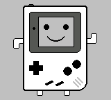
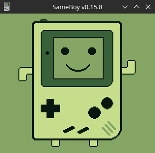

# GameBoy Example 05: Graphics 2

> Related article (in French): https://blog.flozz.fr/2018/11/19/developpement-gameboy-5-creer-des-tilesets/

This time the article will be more targeted: we will see how to create tiles that can be used by our applications. We will start by looking at how the images must be encoded to be able to be copied into the video memory. We will then see how to convert the images with a small tool called [img2gb](https://github.com/flozz/img2gb#readme).

In the last part of the previous example, we quickly saw how to display tiles on the GameBoy screen, but we didn't take the time to explain how to go from an PNG image to a byte array. We will therefore look step by step at how to encode each pixel of an image so that it can be used in our game. Since it will always be the same for each tile, we will focus on just one. 

The first thing to do is to match each pixel to one of the colors in the GameBoy palette, knowing that each color corresponds to a number. We will see later that there are in fact several palettes, and that we can modify them. Then, you must convert the color numbers into binary (2 bits per pixel). Finally, you have to group the bits obtained into bytes, this is the most complicated part because the encoding is not necessarily the most intuitive:

* Each line (8px) is encoded on 2 bytes (16 bits).
* To encode the first pixel, we place the low order bit of our color in the high order bit of the first byte, and the high order bit of the color in the high order bit of the second byte.
* For the second pixel, we place the least significant bit of the color in the second most significant bit of the first byte, and the most significant bit of the color in the second most significant bit of the second byte.
* And so on until the end of the line.
* And we start the same operation again for each line until the end of the tile. In the end we will end up with 16 bytes (i.e. 128 bits) representing our image.

In the end we just have to convert our bytes in C, in hexadecimal writing because it is still shorter. As you can see, it's not that complicated, but if we had to do it by hand it would be very repetitive and it would take a lot of time. That's why we're going to see how to automate the conversion in the rest of this article.

## Convert images with [img2gb](https://github.com/flozz/img2gb#readme) and display it

[img2gb](https://github.com/flozz/img2gb#readme) is a small Python software developed by [Fabien LOISON](https://www.flozz.fr/) (also the original author of theses documents) to automate the conversion of an image into `tileset` and `tilemap` usable on GameBoy. Concretely, it takes as input an image in a common format (PNG, JPEG,...) and as output it generates `.c`/`.h` files.

The software should run on any OS where a Python (2.7 or 3.x) environment is available and its only dependency is Pillow (an image manipulation library). We will therefore start by installing it in order to be able to use it (you will probably need root rights on Linux):

> sudo pip install img2gb

For our example, we will convert the following image and write a little code to display it on a GameBoy:



To achieve our goals, we will need two steps:

1. Generate a tileset (i.e. cut the image into 8x8 pixel tiles, converted into the correct format, which will be placed in the GameBoy's video memory).
2. Generate a tilemap that will tell the GameBoy where to place each of the tiles generated in the previous step.

To begin, we will use img2gb to convert img.png into tileset:

```
img2gb tileset \
    --output-c-file=src/tileset.c \
    --output-header-file=src/tileset.h \
    --output-image=src/tileset.png \
    --deduplicate \
    ./img.png
```

Let's take the time to detail the command arguments a little:

* tileset: tells img2gb that we want to generate a tileset
* `--output-c-file=src/tileset.c`: The destination of the `.c` file to generate
* `--output-header-file=src/tileset.h`: Generates the header file `.h` in `src/tileset.h`
* `--output-image=src/tileset.png`: Generates the tileset imagein `src/tileset.png`. This image has two interests:
    * it allows us to see the result of what will actually be placed in the GameBoy's memory
    * we will need it to generate the tilemap in the next step.
* `--deduplicate`: Avoid including identical tiles several times. Given that our image is made up of 360 tiles and that we can only store 255 in memory, we have no choice anyway; for this example we will have to optimize by deduplicating the tiles.
* `img.png`: The image to convert.

Next, we need to generate the tilemap which will allow us to reconstruct the image:

```
img2gb tilemap\
    --output-c-file=src/tilemap.c \
    --output-header-file=src/tilemap.h \
    src/tileset.png \
    ./img.png
```

Once again, let's detail the arguments:

* `tilemap`: tells img2gb that this time we will generate a tilemap
* `--output-c-file=src/tilemap.c`: The destination of the `.c` file to generate
* `--output-header-file=src/tilemap.c`: The destination of the `.h` file to generate
* `src/tileset.png`: The path to the image representing the tileset containing all the tiles used in the image (this is the image generated by the --output-image option in the previous step)
* `img.png`: The image to map

Let's take a quick look at the generated `.h` files `src/tileset.h`:

```
// This file was generated by img2gb, DO NOT EDIT

#ifndef _TILESET_H
#define _TILESET_H

extern const UINT8 TILESET[];
#define TILESET_TILE_COUNT 97


#endif
```

Here, we can see that a TILESET variable is available, it is this which contains all the tiles extracted from the image. We also see that a TILESET_TILE_COUNT macro has been generated and that it contains the number of tiles (we therefore have 97 different tiles to display our image). Here is `src/tilemap.h`:

```
// This file was generated by img2gb, DO NOT EDIT

#ifndef _TILEMAP_H
#define _TILEMAP_H

extern const UINT8 TILEMAP[];
#define TILEMAP_WIDTH 20
#define TILEMAP_HEIGHT 18


#endif
```

In this file, we find the TILEMAP variable and the TILEMAP_WIDTH and TILEMAP_HEIGHT macros. They contain respectively the tilemap allowing us to recompose our image, the width of said tilemap and its height.

Now that we have converted our image to C, and we have all the necessary information, we can write a small program to display it on the screen of a GameBoy. Here is the content of the main.c file:

```
#include <gb/gb.h>

#include "tileset.h"
#include "tilemap.h"

void main(void) {
    set_bkg_data(0, TILESET_TILE_COUNT, TILESET);
    set_bkg_tiles(0, 0, TILEMAP_WIDTH, TILEMAP_HEIGHT, TILEMAP);
    SHOW_BKG;
}
```

You can buiild it make to execute the Project's Makefile, then running Sameboy as follow:

> make && sameboy Graphics2.gb

At this point, if everything went well, you should see a result similar to this:

