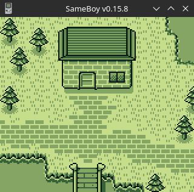

# GameBoy Example 06: Graphics 3 - background

> Related article (in French): https://blog.flozz.fr/2018/12/05/developpement-gameboy-6-la-couche-background/

 In this article we will talk about the Background layer. The Background layer is probably one of the most important: it's what we use to display the level (think of the map on which we move in Pokemon , or the platforms in Super Mario). Some games even only use this layer.

As a reminder, this layer is one of the “three” available, and as its name suggests, Sprite, window, background. The Background layer has dimensions of 32×32 tiles, which is larger than what the GameBoy screen can display (which has dimensions of 20×18 tiles). Only part of the layer is therefore visible on the screen at a given time. The advantage of the layer being larger than the screen is that it is possible to scroll it (we speak of scrolling). When you reach the edge of the layer and continue to scroll, it loops back to the opposite side.

GBDK-2020 provides us with a whole set of functions and macros to manipulate the Background layer , we will see them all in detail in this section.

## Show/hide Background layer

To begin, we will talk about the two macros allowing you to show and hide the Background layer.

By default, the layer is hidden, so you will need to make it visible if you want to be able to test the following examples:

> SHOW_BKG;

And we can hide it again via the following macro:

> HIDE_BKG;

## Copy tiles to video memory

To display tiles, you must first copy them into video memory, this is done using the following function:

> void set_bkg_data (uint8_t first_tile, uint8_t nb_tiles, unsigned char *data);

* first_tile: the memory box from which we will place the tiles. If we put 16 for example, the first tile of our tileset will be in box 16, the second in box 17, etc. It is this number which can be found in the tilemap.
* nb_tiles: number of tiles to copy into video memory.
* *data: pointer to our tile data.

## Displaying tiles (and rereading them)

Once the tiles are in the GameBoy's video memory, you must tell it where to display them. To do this, you must provide it with a tilemap.

To send a tilemap to video memory, you must use the following function:

> void set_bkg_tiles (uint8_t x, uint8_t y, uint8_t w, uint8_t h, unsigned char * tiles);      

* x, y: Destination coordinates of our tilemap where it will be pasted on the Background layer. The coordinates are expressed in tiles (integer between 0 and 31).
* w, h: Width and height of our tilemap, expressed in tiles (integer between 0 and 31).
* *tiles: pointer to tilemap data.

In addition to allowing us to paste tilesmaps on the Background layer, GBDK-2020 provides us with a second function allowing us to retrieve this data to know what the layer looks like at a given time:

> void get_bkg_tiles(uint8_t x, uint8_t y, uint8_t w, uint8_t h, unsigned char * tiles);  

* x, y: Original coordinates of the area to copy, expressed in tiles (integer between 0 and 31).
* w, h: Width and height of the area to copy, expressed in tiles (integer between 0 and 31).
* *tiles: pointer to a table where the data will be copied. Be careful, you have to remember to allocate enough memory to contain the data (for example 56 bytes if w = 8 and h = 7).

## Move/scroll the Background

GBDK-2020 provides us with two different functions to move the Background:

* scroll_bkg(), which scrolls the Background layer relative to its current position,
* and move_bkg(), which moves the layer to the requested absolute position.

> void scroll_bkg(uint8_t x, uint8_t y);

* x, y: displacement to apply (for example +1 , -1 ,...). Be careful, this time, the movement is expressed in pixels and not in tiles!

> void move_bkg(uint8_t x, uint8_t y);    

* x, y: coordinates where you want to move the Background layer (coordinates of the top left corner of the screen). Coordinates are expressed in pixels.

## Complete Example

Now that we know all the functions and macros used to manipulate the Background layer, here is a small example to see it all in action:

```
#include <gb/gb.h>

#include "tileset.h"
#include "tilemap.h"

void main(void) {
    UINT8 keys;

    // Copy the tileset in the video memory
    set_bkg_data(0, TILESET_TILE_COUNT, TILESET);

    // Copy the tilemap in the video memory
    set_bkg_tiles(0, 0, TILEMAP_WIDTH, TILEMAP_HEIGHT, TILEMAP);

    // Display the background layer
    SHOW_BKG;

    while (1) {
        keys = joypad();

        // Scroll to the corresponding direction when a button
        // of the D-Pad is pressed
        if (keys & J_UP) scroll_bkg(0, -1);
        if (keys & J_DOWN) scroll_bkg(0, 1);
        if (keys & J_LEFT) scroll_bkg(-1, 0);
        if (keys & J_RIGHT) scroll_bkg(1, 0);

        // Reset background position when START is pressed
        if (keys & J_START) move_bkg(0, 0);

        // Wait until the screen was redrawn
        wait_vbl_done();
    }
}
```

This example displays a 32×32 tile map in which it is possible to move using the directional cross. Pressing START resets the view to its initial position.


