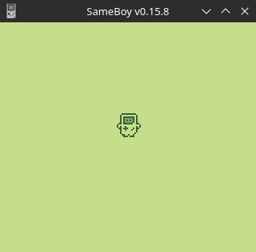

# GameBoy Example 07: Graphics 4 - sprites

> Related article (in French): https://blog.flozz.fr/2019/02/05/developpement-gameboy-7-les-sprites/

This time we are going to tackle sprites, essential elements of any minimally interactive game. Sprites are the most “complex” graphic elements offered by the GameBoy. We will therefore start by listing their characteristics, and I will detail how to use them in the rest of the article. To begin with, unlike the Background and Window layers, sprites are not positioned on a grid, they can be positioned anywhere on the screen. The sprites can be composed of 1 or 2 tiles arranged vertically and can therefore have dimensions of 8×8 or 8×16 pixels (16×8 pixels is not possible). You can simultaneously display up to 40 sprites on the screen, however there is a limitation: you cannot display more than 10 on a pixel line. When this happens, part of the lowest priority sprite will not be displayed.

On the GameBoy, the priority between two sprites are resolved as follows:

* the sprite having the smallest x coordinate (therefore finding the further to the left) has priority.
* If the two sprites have the same coordinates x, then it is the one that appears first in the table of sprites which has priority (the sprite number < a i=7>0 is priority on number 1).

When two sprites overlap, the one with higher priority The highest priority will be drawn over the one with the lowest priority.

Note however that on GameBoy Color (when not in mode GameBoy compatibility), priority is only calculated by order appearance of the sprite in the table of sprites, its position on screen does not influence.

Unlike the tiles used on Background or Window, the tiles used to compose sprites can only contain 3 colors (instead of 4). Indeed, one of the colors in the palette is transparent to show what is behind it. To compensate for the loss of a color, we have the choice between two palettes for the tiles sprites. By default, these palettes are composed of the following colors (we will see in the next article how to modify them):

* Light gray, dark gray and black, white being transparent,
* or dark gray, light gray and white with transparent black color.

It is also possible to display the sprites in front (default) or behind layers Background and Window. If a sprite is positioned at the back, it will only be visible where the layers Background and Window are composed of white pixels. Finally, it is possible to flip horizontally and vertically the sprites, which allows the same tiles to be reused in several situations and thus save space in memory.

As we mentioned in the layer Background example, we talked about a memory area allowing you to store the map of tiles of the layer (Background map), well for the sprites, he There is also a memory area, called OAM (Object Attribute Memory) which contains all the properties I listed above for each of the 40 sprites. We are obviously not going to modify it directly given that GBDK provides us with some functions for this.

## Load tiles into memory

Before being able to display any sprite on the screen, it is necessary, as for the other layers, to load tiles into the GameBoy's video memory. GBDK of course provides us with a function for that:

> void set_sprite_data(uint8_t first_tile, uint8_t nb_tiles, unsigned char* data);

The only difference with `set_bkg_data()`, the function used to load the tiles used by the Backrgound and Window layers, This is because the data is not sent to the same location in memory. I So I'm not going to go into more detail given that it works from there, same way.

> Enable/disable “layer” Sprites

As for the other layers, the sprites are not displayed by default, you will therefore have to make them visible with the following macro:

> SHOW_SPRITES;

And it is possible to hide them with the macro:

> HIDE_SPRITES;

## Display a sprite and position it

Let's finally get down to business: display a sprite wherever you want on screen. As I said in the introduction, the GameBoy can display up to 40sprites on screen. Each of them is identified by a number (from 0 to 39) which will be passed as a parameter to the functions handling the sprites.

To begin, you will have to assign a tile to one of the sprites (otherwise the GameBoy wouldn't know what to display). This is done using the function following:

> void set_sprite_tile(uint8_t nb, uint_8 tile);

* nb corresponds to the number of the sprite to modify ( 0-39),
* tile corresponds to the number of the tile that will be contained in this sprite (0-255)

There is also a function `uint8_t get_sprite_tile(uint8_t nb)`, which allows you to retrieve the id of the tile used by a sprite given.

We can then move the sprite where we want it on the screen using one of the following two functions:

> void move_sprite(uint8_t nb, uint8_t x, uint8_t y);

This function moves the sprite nb to the coordinates ( x, y) indicated.

> void scroll_sprite(uint8_t nb, uint8_t x, uint8_t y);

This function does the same thing, but the displacement is relative (if we put x to -5, on sprite will be moved 5 pixels to the left).

There is a small subtlety that I have not yet addressed in the placement of sprites : the top left corner of the screen has coordinates (8, 16) (and not (0, 0) as one might have expected). This allows you to do overflow a sprite on the left and top edges of the screen.

Finally, the sprites become hidden when their coordinates place them outside from the screen:

* when x is equal to 0 or greater or equal to 168, or when y is equal to 0 or greater or equal to 160.
* This is also how we individually hide a sprite.

To hide a sprite, it is preferable to put its coordinate y to 0 rather than using x. Indeed, if we hide the sprite by setting x to 0, it continues to be taken into account in the priority calculation and continues to limit the number of sprites per line.

## Modify the properties of a sprite

As we saw in the introduction, the GameBoy allows you to operate a certain number of modifications on a sprite :

* change the color palette used to display it,
* turn it horizontally,
* turn it vertically,
* change its priority (to place it in front of or behind the other layers).

All these modifications can be done using the function set_sprite_prop():

> voidset_sprite_prop(UINT8nb ,UINT8prop);

* nb corresponds to the number of the sprite to modify ( 0-39),
* prop corresponds to the modifications to be made to the sprite.

There is again a function UINT8 get_sprite_prop(UINT8 nb) to retrieve the current state of a sprite.

The argument prop is therefore a number of which 4 of the 8 bits correspond to flags activating one of the changes. The remaining 4 bits are not used on the original GameBoy, but will later be used by the GameBoy Color (but that’s another story). GBDK provides us with constants containing the masks allowing us to manipulate each of the bits that interest us. To use these masks, you will therefore need still playing with binary operations. And to deactivate one of the modifications (and therefore pass the corresponding bit at 0), it will be necessary to apply the complement of the mask to the current value of prop using the binary operation AND.

## Change the palette of a sprite

To change the palette used to draw a sprite, you must use the mask S_PALETTE to modify the 5th bit of prop:

* changing it to 0 allows you to use the default palette,
* changing it to 1 allows you to use the alternate palette.

## Flip a sprite horizontally

To flip a sprite horizontally the mask to use is S_FLIPX, which will modify the 6th bit of prop. a>

* When the bit is at 0, the sprite is displayed normally (not returned),
* when the bit is at 1, the sprite returned.

## Flip a sprite vertically

To flip a sprite vertically, you must use the mask S_FLIPY, which will allow us to modify the 7th bit of prop.< /span>

* When the bit is at 0, the sprite is displayed normally (not returned),
* when the bit is at 1, the sprite returned.

## Show a sprite behind the layer Background

Finally, to show the sprite behind the layers Background and Window, it is the 8th bit that must be modified using the mask S_PRIORITY :

* changing the bit to 0 will display the sprite in front (default behavior),
* moving the bit to 1 will display it behind.

When a sprite is displayed behind layers Background and Window, it is only visible ;in places where the color of these layers is 0 (white).

## Using sprites in 8×16

Last possibility offered by the GameBoy: use sprites of 8×16 pixels. However, this configuration is activated globally: it is not not possible to use sprites of 8×8 px and 8×16 px at the same time.

The sprites of 8×16 px therefore display 2 tiles, one below the other, and there are some subtleties to know. We saw earlier how to define the tile which must be displayed by a sprite of 8×8 px, well for sprites bigger is the same... except tiles work per pair: simply indicate any of the two tiles of a pair, and the first will be displayed at the top and the second at the bottom (so indicate the tile 0 or 1 will have strictly the same effect). To activate the sprites of 8×16 px, you must use the following macro:

> SPRITES_8x16;

And to revert the sprites to 8×8 px, the macro to use is:

> SPRITES_8x8;

## A little example to digest

After all these technical details on the functioning of sprites it is finally time to get our hands dirty to see what it's like actually works in a situation. So I offer you this little example in which we are going to animate a small character in the shape of a GameBoy, which we let's call Gaby (for Gameboy Animated Blayer Yolo, #JaiPasTrouvéMieux). Gaby can be moved in all four directions using the D-Pad.

Here is the list of features of Gaby the GameBoy:

* It measures 16×16 px : you will therefore need 2 sprites of 8×16 px< /span> for represent.
* She walks in 4 directions: it will therefore be necessary to plan tiles for each direction (in reality 3 directions will be enough: we will use mirror function for right and left directions).
* It is animated: you will have to draw all the tiles of animation and provide code to change tiles with the right timing.
* Given that Gaby is a white GameBoy, we will use the palette of alternative color (the black color will therefore be transparent).

To begin, you must draw the tiles that will be used in the sprites. Here are some small details to note for the drawing:

I'm going to draw the tiles as if I were going to use the color palette normal (keeping in mind that black will be the transparent color), and I would let img2gb invert the colors using its option --alternative-palette.

As we saw earlier, you have to arrange the tiles in a certain way particular to use them in sprites of 8×16: you must position the tiles of the same pair next to each other, then that they will be displayed one below the other... which is not convenient for drawing. So I'm still going to draw them one in below the other, and use the--sprite8x16 option ofimg2gb for automatically rearrange.

Now that we have drawn the tiles, we can generate the tileset which can be used on GameBoy. To do this, we will use img2gb, the little tool that I presented to you in a previous article:

```
img2gb tileset \
    --output-c-file=src/player.sprites.c \
    --output-header-file=src/player.sprites.h \
    --output-image=src/player.sprites.png \
    --alternative-palette \
    --sprite8x16 \
    --name PLAYER_SPRITES \
    ./player.png
```

This command generates files .c and .h that we can use in our program, and a file .png which allows us to see the result of the transformation (this time again I zoomed the image and put highlight the first two pairs). 

Now that we have everything we need in terms of graphics, we can move on to coded. Here is the complete code of the example, all well commented, (yes it is a little long, but if you take the time to read it quietly at the beginning by the function main(), this is understood quite well)

```
Por codigo aqui, mas reve codigo antes
```

When we compile all this and run it in an emulator, it gives the following result:

