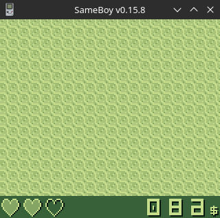

# GameBoy Example 08: Graphics 5 - window

> Related article (in French): https://blog.flozz.fr/2019/06/30/developpement-gameboy-8-la-couche-window/

The layer Window is the last one that remained to be processed. It is generally used to display fixed information on the screen (life points, timer,...) or message boxes. It is located above the layer Background, and can therefore hide it when displayed. Like the Background layer, the Window layer takes the shape of a tile grid, but unlike the Background layer, it cannot be scrolled. However, it can be moved to only partially cover the Background layer. Its positioning is however subject to a certain number of constraints: in particular we cannot display it at negative coordinates (otherwise it is hidden), we can therefore only make it extend beyond the bottom or to the right of the screen (this is why most game UIs are located at the bottom of the screen and not at the top).

## APIs

Just like the Background layer and the Sprites, layer Window is hidden by default, and you can control when to Show/hide Window layer. It must therefore be displayed with the following macro:

> SHOW_WIN;

And it is possible to hide it again using this other macro:

> HIDE_WIN;

##Copy tiles to video memory

GBDK provides us with the following function to copy tiles to the console's video memory:

> void set_win_data(uint8_t first_tile,uint8_t nb_tiles, unsigned char* data);

This function copies the tiles to the same location as those in the Background layer. We can therefore consider that this function is an alias of set_bkg_data(). This is why I refer you to the Background layer documentation for more information.

## Show/reread tiles

As for the Background layer, you must load a tilemap in the console's video memory to display something. This is done using the following function:

> void set_win_tiles(uint8_t x,uint8_t y,uint8_t w, uint8_t h, unsigned char* tiles);

And always, as for the layer Background, it is possible to reread the tiles composing the tilemap using the following function:

> void get_win_tiles(uint8_t x, uint8_t y, uint8_t w, uint8_t h, unsigned char* tiles);           

The API being completely identical to that of the layer Background.

## Move the Window layer

To move the layer Window, GBDK provides us with two functions:

* scroll_win(), which moves the layer relative to its current position,
* move_win(), which moves it absolutely to the requested coordinates (the coordinates provided correspond to the top left corner of the layer).

> void scroll_win(int8_t x ,int8_t y);

x, y: displacement, expressed in pixels, to apply (for example +1, -1,...).

> void move_win(uint8_t x, uint8_t y);    

* x: Horizontal coordinate of the top left corner of the layer Window (in pixels) . This is an integer between 0 and 166< has i=7>, any other value hides the layer.
* y: Vertical coordinate of the top left corner of the layer Window (in pixels) . This is an integer between 0 and 143< has i=7>, any other value hides the layer.

Small subtlety in the layer coordinates Window: the top left corner of the screen has the coordinates  :x pixels on the axis -7. There is therefore an offset of (7, 0).

## Example

Now that we have seen the theory, we will move on to practice. For this example, we will display an interface displaying the player's life points and money at the bottom of the screen and scroll a pattern on the layer Background remains static above.Windows to clearly see that the layer. The tile at the top left will be used for the Background, the others to display the interface on the layer Window.

So here is the example code:

```
CODE HERE
```

And here's what it looks like once launched in an emulator:


