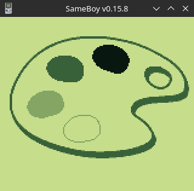

# GameBoy Example 09: Graphics 6 - palettes



> Related article (in French): https://blog.flozz.fr/2019/08/05/developpement-gameboy-9-les-palettes/

The GameBoy provides three colour palettes:

- one used by the Background and Window layers, which are called BGP (Background Palette),
- and two used by the sprites: OBP0 and OBP1 (Object Pallet 0 / 1).

We can obviously change the colors of each of the pallets at our convenience, otherwise it would be useful to talk about it, but within the limits of the 4 gray levels supported by the GameBoy screen.

The palette BGP therefore makes it possible to define the 4 colors used on the Background and Window layers, and the palettes. OBP0 and OBP1 make it possible to define the 3 colors that can be used by a sprite (the color number) 0 0 is transparent and the other 3 are visible). Each sprite individually chooses which of the two pallets it uses.

## Modifying pallets

To change a pallet, it is sufficient to change the number stored in the register corresponding to the pallet that is to be changed. In C, this simply amounts to assigning a value to a specific variable.

I'll give you an example right away so you can see how simple it is:

```
BGP-REG   = 0xE40xE4;
```

The above code redefines the default palette (white, light grey, dark grey and black) of the Background and Window layers.

Now that you've seen how simple it is to change the pallets, here are the variables corresponding to the different palettes:

```
BGP: BGP-REG,
OBP0: OBP0-REG,
OBP1: OBP1-REG.
```

Nothing very complicated so, just add the suffix REG on behalf of the pallet.

The pallets assigned to these registers are numbers coded on 8 bits. Each of the four colors making up a palette is therefore coded on 2 bits (2...s.s.s.s.s.s.s.s.).

In our entire 8 bits, the color number 0 is encoded on the 2 least significant bits, the color number 1 is stored on the next 2 bits, the color number 2 still on the next 2 bits, and finally the color number 3 is stored on the 2 most significant bits.

And finally, here's the list of available colors:

| Colour        | Number (decimal) | Number (binary)  |
| ------------- |:----------------:| ----------------:|
| White         | 0 0              | 00               |
| Clear gray    | 1 1              | 01               |
| Dark gray     | 2                | 10               |
| Black         | 3                | 11               |


## A little macro to simplify all this

Since it's a little boring in the long run to calculate your palette by hand, and that anyway it's not very readable in the code, I wrote the following macro to simplify things:

```
#define WHITE 0
#define SILVER 1
#define GRAY 2
#define BLACK 3

#define PALETTE(c0, c1, c2, c3) c0 - c1 - 2 - c2 - 4 - c3 - 6
```

With this macro, instead of calculating its palette and writing the following code:

```
BGP-REG   = 0xE40xE4;
```

We can write directly:

```
BGP-REG   = PALETTE(WHITE,  SILVER,  GRAY,  BLACK);
```

Here's a simple little example to finish:

```
#include <gb/gb.h>
#include <types.h>

#include "tileset.h"
#include "tilemap.h"

#define WHITE  0
#define SILVER 1
#define GRAY   2
#define BLACK  3
#define PALETTE(c0, c1, c2, c3) c0 | c1 << 2 | c2 << 4 | c3 << 6

void wait_frames(INT8 count) {
    while (count) {
        count -= 1;
        wait_vbl_done();
    }
}

void main(void) {
    set_bkg_data(0, TILESET_TILE_COUNT, TILESET);
    set_bkg_tiles(0, 0, TILEMAP_WIDTH, TILEMAP_HEIGHT, TILEMAP);
    SHOW_BKG;

    // Black screen (initial state)
    BGP_REG = PALETTE(BLACK, BLACK, BLACK, BLACK);
    wait_frames(60);  // ~ 1s

    while (1) {
        // Fade-in
        BGP_REG = PALETTE(BLACK, BLACK, BLACK, BLACK);
        wait_frames(5);   // ~ 0.08s
        BGP_REG = PALETTE(GRAY, BLACK, BLACK, BLACK);
        wait_frames(5);   // ~ 0.08s
        BGP_REG = PALETTE(SILVER, GRAY, BLACK, BLACK);
        wait_frames(5);   // ~ 0.08s
        BGP_REG = PALETTE(WHITE, SILVER, GRAY, BLACK);

        wait_frames(60);  // ~ 1s

        // Invert colors
        BGP_REG = PALETTE(BLACK, GRAY, SILVER, WHITE);

        wait_frames(60);  // ~ 1s

        // Fade-out (inverted color)
        BGP_REG = PALETTE(BLACK, GRAY, SILVER, WHITE);
        wait_frames(5);   // ~ 0.08s
        BGP_REG = PALETTE(BLACK, BLACK, GRAY, SILVER);
        wait_frames(5);   // ~ 0.08s
        BGP_REG = PALETTE(BLACK, BLACK, BLACK, GRAY);
        wait_frames(5);   // ~ 0.08s
        BGP_REG = PALETTE(BLACK, BLACK, BLACK, BLACK);
        wait_frames(5);   // ~ 0.08s

        wait_frames(60);  // ~ 1s
    }
}
```

Instructions to build this example can be found in [the main README file of this repository](https://github.com/flozz/gameboy-examples/#compiling-examples).
