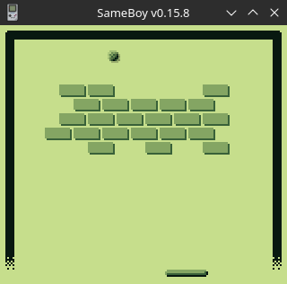

# GameBoy Example 10: Breakout



> Related article (in French): https://blog.flozz.fr/2019/10/16/developpement-gameboy-10-projet-2-breakout-partie-3/

We're finally going to be able to break bricks... it's cool... but in fact you're going to be disappointed quickly, because in fact, it's extremely simple: when we check whether the ball collides with the environment, just look in the way whether it would be a tile representing a brick, and if that's the case, we delete it. Well, there's still a little subtlety: the bricks are made up of two tiles, so we're back in two cases:

    if you type into the left side of the brick, you have to delete this tile, and the one immediately to its right,
    And if we type in the right-hand part of the brick, in this case it must be deleted with the tile immediately to its left.

Yes, there's no more difficulty than that. So I'm going to create a little function that deletes a brick if you give it the coordinates of the leftmost tile:

```
#define TILE_EMPTY      128

void remove_brick(UINT8 x, UINT8 y) {
    UINT8 cells[2] = {TILE_EMPTY, TILE_EMPTY};
    set_bkg_tiles(x, y, 2, 1, cells);
}
```

And I'm going to add the next code in the function. `check-ball-collide()`:

```
#define TILE_BRICK_L   136
#define TILE_BRICK_R   137

UINT8 check_ball_collide(INT8 delta_x, INT8 delta_y) {

    // ...

    // remove bricks
    switch (next_cell[0]) {
        case TILE_BRICK_L:
            remove_brick(ball_next_cell_x, ball_next_cell_y);
            break;
        case TILE_BRICK_R:
            remove_brick(ball_next_cell_x - 1, ball_next_cell_y);
            break;
    }

    // ...

}
```

**NOTE**: It is not necessarily very “cleaning” (from a code organization point of view) to delete the bricks in the middle of the code of a function that is supposed to only check the collisions, but the aim here is to arrive quickly at a result. We'll have to improve that later if we go beyond the PoC stage.

## Game Over

A game where you can't lose isn't fun, so I'm going to implement the game over no later than right away. To lose the game, the condition is simple: it is enough for the ball to touch the bottom of the screen. The following function can therefore be written:

```
UINT8 check_gameover() {
    return BALL_Y + BALL_WIDTH >= 18 * 8 + 16;
    // 18 * 8 -> hauteur de l'écran en pixels
    // 16 -> offset de la position des sprites sur l'axe y
}
```

Well normally we would have to display a nice game over screen and everything, but for the moment we're going to do the simplest, otherwise this article will end up being far too long. So we're just going to cut the loop for the moment, which will have the effect of finishing the game (otherwise it will be necessary to restart the console to replay).

We're now in possession of a prototype of brick-breathing that works... and I'm going to stop there for this article because it's going to start to get too long if otherwise. But to do things right, there would still be a lot of work.

It should already be done by displaying a congratulatory screen when the player wins and a game over screen when he loses. And while we're at it, we could add a title screen. It would, of course, also be necessary to allow the player to restart a game without restarting the console.

Finally, the gameplay needs to be improved:

- At present, the ball always moves at the same angle... it would be necessary to vary this angle when the player hits the ball while moving the racket or if he catches up with the end of the racket (if not all the parts take place in exactly the same way).
- We could also let the player start where he wants, by sticking the ball to the racket at the beginning of the game and throwing the ball when he presses the button A.
- Ideally, we should also add a system of life so that we do not lose everything in a single ball.
- You could also add different bricks (which don't break in a single shot, for example), and why not, add bonuses to catch up.
- And finally, we should obviously add a lot of levels... otherwise it's going to be very repetitive.

So I leave it to you to continue the development of the game, if you do, of course, want to do so. And if you do, don't hesitate to post a link to your project in the comments or send me an email. Who knows, if I get some nice proposals I could perhaps present them to you here. 


```
#include <gb/gb.h>

#include "./levels.tileset.h"
#include "./level01.tilemap.h"

#define TRUE   1
#define FALSE  0

#define TILE_WIDTH         8
#define SCREEN_WIDTH_TILE  20
#define SCREEN_WIDTH_PX    SCREEN_WIDTH_TILE * TILE_WIDTH
#define SCREEN_HEIGH_TILE  18
#define SCREEN_HEIGH_PX    SCREEN_HEIGH_TILE * TILE_WIDTH

#define SPRITE_OFFSET_X  8
#define SPRITE_OFFSET_Y  16

#define TILE_OFFSET    128
#define TILE_EMPTY     TILE_OFFSET + 0
#define TILE_BRICK_L   TILE_OFFSET + 8
#define TILE_BRICK_R   TILE_OFFSET + 9
#define TILE_PADDLE_L  TILE_OFFSET + 12
#define TILE_PADDLE_C  TILE_OFFSET + 13
#define TILE_PADDLE_R  TILE_OFFSET + 14
#define TILE_BALL      TILE_OFFSET + 15

#define SPRITE_BALL      0
#define SPRITE_PADDLE_L  1
#define SPRITE_PADDLE_C  2
#define SPRITE_PADDLE_R  3

#define PADDLE_Y         SPRITE_OFFSET_Y + (SCREEN_HEIGH_TILE - 1) * TILE_WIDTH
#define PADDLE_WIDTH     3 * TILE_WIDTH
#define PADDLE_ORIG_X    SPRITE_OFFSET_X + (SCREEN_WIDTH_PX - PADDLE_WIDTH) / 2

#define BALL_WIDTH  6

#define LEVEL01_BRICK_COUNT 39

UINT8 PADDLE_X;

UINT8 BALL_X = 50;
UINT8 BALL_Y = 120;
INT8 BALL_DELTA_X = 1;
INT8 BALL_DELTA_Y = -1;

UINT8 REMAINING_BRICKS = LEVEL01_BRICK_COUNT;


void move_paddle(INT8 delta) {
    // Update paddle's position
    if (delta == 0) {
        PADDLE_X = PADDLE_ORIG_X;
    } else {
        PADDLE_X += delta;
    }

    // Check that the paddle stay in the screen
    if (PADDLE_X < SPRITE_OFFSET_X) {
        PADDLE_X = SPRITE_OFFSET_X;
    } else if (PADDLE_X > SPRITE_OFFSET_X + SCREEN_WIDTH_PX - PADDLE_WIDTH) {
        PADDLE_X = SPRITE_OFFSET_X + SCREEN_WIDTH_PX - PADDLE_WIDTH;
    }

    // Move paddle's sprites
    move_sprite(SPRITE_PADDLE_L, PADDLE_X, PADDLE_Y);
    move_sprite(SPRITE_PADDLE_C, PADDLE_X + TILE_WIDTH, PADDLE_Y);
    move_sprite(SPRITE_PADDLE_R, PADDLE_X + 2 * TILE_WIDTH, PADDLE_Y);
}

void remove_brick(UINT8 x, UINT8 y) {
    UINT8 cells[2] = {TILE_EMPTY, TILE_EMPTY};
    set_bkg_tiles(x, y, 2, 1, cells);
    REMAINING_BRICKS -= 1;
}

UINT8 check_ball_collide(INT8 delta_x, INT8 delta_y) {
    UINT8 ball_x = BALL_X + delta_x;
    UINT8 ball_y = BALL_Y + delta_y;

    // Paddle
    if (ball_y + BALL_WIDTH - 1 >= PADDLE_Y) {
        if (ball_x >= PADDLE_X && ball_x <= PADDLE_X + PADDLE_WIDTH) {
            return TRUE;
        }
        if (ball_x + BALL_WIDTH - 1 >= PADDLE_X && ball_x + BALL_WIDTH <= PADDLE_X + PADDLE_WIDTH) {
            return TRUE;
        }
    }

    // Environment

    // Change considered ball collision point depending on direction
    if (BALL_DELTA_X > 0) {
        ball_x += BALL_WIDTH - 1;
    }
    if (BALL_DELTA_Y > 0) {
        ball_y += BALL_WIDTH - 1;
    }

    UINT8 ball_next_cell_x = (ball_x - SPRITE_OFFSET_X) / TILE_WIDTH;
    UINT8 ball_next_cell_y = (ball_y - SPRITE_OFFSET_Y) / TILE_WIDTH;
    UINT8 next_cell[1];

    get_bkg_tiles(ball_next_cell_x, ball_next_cell_y, 1, 1, next_cell);

    // remove bricks
    switch (next_cell[0]) {
        case TILE_BRICK_L:
            remove_brick(ball_next_cell_x, ball_next_cell_y);
            break;
        case TILE_BRICK_R:
            remove_brick(ball_next_cell_x - 1, ball_next_cell_y);
            break;
    }

    // return collision with env
    return next_cell[0] != TILE_EMPTY;
}

UINT8 check_gameover() {
    return BALL_Y + BALL_WIDTH >= SCREEN_HEIGH_PX + SPRITE_OFFSET_Y;
}

void main(void) {
    set_bkg_data(TILE_OFFSET, LEVELS_TILESET_TILE_COUNT, LEVELS_TILESET);
    set_bkg_tiles(0, 0, LEVEL01_TILEMAP_WIDTH, LEVEL01_TILEMAP_HEIGHT, LEVEL01_TILEMAP);
    SHOW_BKG;

    set_sprite_tile(SPRITE_BALL, TILE_BALL);
    set_sprite_tile(SPRITE_PADDLE_L, TILE_PADDLE_L);
    set_sprite_tile(SPRITE_PADDLE_C, TILE_PADDLE_C);
    set_sprite_tile(SPRITE_PADDLE_R, TILE_PADDLE_R);
    move_paddle(0);
    move_sprite(SPRITE_BALL, BALL_X, BALL_Y);
    SHOW_SPRITES;

    while (REMAINING_BRICKS) {
        // Player's moves
        UINT8 keys = joypad();
        if (keys & J_LEFT) {
            move_paddle(-2);
        } else if (keys & J_RIGHT) {
            move_paddle(+2);
        }

        // Check for Game Over
        if (check_gameover()) {
            break;
        }

        // Move the ball
        if (check_ball_collide(BALL_DELTA_X, 0)) {
            BALL_DELTA_X = -BALL_DELTA_X;
        }
        if (check_ball_collide(0, BALL_DELTA_Y)) {
            BALL_DELTA_Y = -BALL_DELTA_Y;
        }
        BALL_X += BALL_DELTA_X;
        BALL_Y += BALL_DELTA_Y;
        move_sprite(SPRITE_BALL, BALL_X, BALL_Y);

        wait_vbl_done();
    }
}
```

Instructions to build this example can be found in [the main README file of this repository](https://github.com/flozz/gameboy-examples/#compiling-examples).
