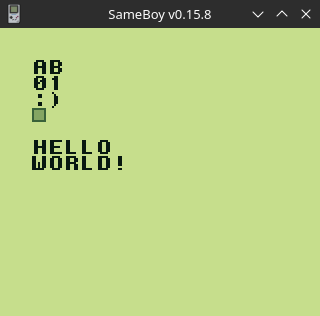

# GameBoy Example 11: Custom Text



> Related article (in French): https://blog.flozz.fr/2020/10/21/developpement-gameboy-11-gerer-et-afficher-du-texte/

It's been a year since I've released an article about the GameBoy. I had indeed moved a little away from retro development to focus on other projects, but that is it, I'm finally going to take up this series of articles (you don't expect regular publications).

Today we are going to deal with a subject that has been asked a lot, a lot, for a lot of what I have been asked: to manage the text. So we're going to see in this article how to create a do, how to load it into memory, and how to use it to display text on a GameBoy.

## stdio.h and printf() aren't your friends.

As I explained in a previous article, although the library "stdio.h" contains everything it takes to display text effortlessly, it is in practice not usable in a game.

This library is indeed going to fill the VRAM with lots of characters that will not be useful to us, and we will have no room left for the tiles of our game. We will therefore have to re-implement a text management system by ourselves, and limit the number of characters available.

## Create a font

Like the other elements that are to be displayed on the screen, a font (or do in English) is composed of tiles. So we're going to start by drawing an image containing all the characters we need. Each character should fit in a tile of 8x8 px.

As you can see, I've included the letters from A to z, but only the capital version: we'll do away with tiny places to save space. I also included the numbers from 0 to 9 and the most common punctuation. And of course, we don't forget to leave a white tile that we'll use for spaces.

The most attentive of you will have noticed that I have also added a grey square and a kind of double line. The grey square is a "TOFU," we'll use it to represent characters that aren't present in our tileset and story of well-seen them during development. The double line, for its part, may later serve us as a border for a message box.

Once we do is ready, we're saving it in a file, which I'll name. "font.png" for me, and then we'll have to convert it into a tile for the GameBoy. To do this, I will use the img2gb software and perform the conversion using the following command:

```
img2gb tileset \
    --output-c-file=src/font.tileset.c \
    --output-header-file=src/font.tileset.h \
    --name=FONT_TILESET \
    font.png
```

## Character management on our computers: the ASCII table

Whether you use a PC, a PS4 or a GameBoy, the characters, such as those that make up this article, are ultimately just numbers. There are large tables assigning a number to each existing character and allowing the machine to know what to display on the screen when it finds that number in memory. One of these tables, which remains one of the most widely used today, is called the ASCII table.

For example, this table can be seen as the letter. "A" capital is numbered 65, that the figure "5" a for the number 53 or the character number 32 corresponds to space.

Why will I tell you about all this, you might ask me? Well, by what we're going to use this ASCII table to display our text. If you take the following code C:

```
printf("Hello");
```

The character string "Hello" is translated by the following sequence of numbers in the computer's memory:

```
72, 101, 108, 108, 111, 0
```

This is the sequence that we're going to have to process to reconstruct our text on the GameBoy screen.

**NOTE**: Do not pay attention to 0 0 at the end of the number table above for the time being, we will discuss this again when the time comes.

## Loading the police of character

To begin with, we have to load the fact that we have created in memory. I'm going to write a function that I'm going to name `text-load()`. Here is the contents of a C file that handles loading the police:

```
#include <gb/gb.h>
#include "./font.tileset.h"

#define TEXT_FONT_OFFSET 0xD0

void text_load_font() {
    set_bkg_data(TEXT_FONT_OFFSET, FONT_TILESET_TILE_COUNT, FONT_TILESET);
}

void main(void) {
    SHOW_BKG;
    text_load_font();
}
```

The above code loads the tiles containing our characters from the address D0 I like to stall my fonttile at the end of the beach so as not to be annoyed later when I charge the other tiles of my game.

## Display a character

We are finally getting to the heart of the subject: the display itself of a character. Let's start by defining a few constants to make our code more readable later:

```
#define TEXT_FONT_OFFSET 0xD0

#define _TEXT_CHAR_A              TEXT_FONT_OFFSET
#define _TEXT_CHAR_0              TEXT_FONT_OFFSET + 26
#define _TEXT_CHAR_COLON          TEXT_FONT_OFFSET + 26 + 10 + 4
#define _TEXT_CHAR_RPARENTHESES   TEXT_FONT_OFFSET + 26 + 10 + 8
#define _TEXT_CHAR_TOFU           TEXT_FONT_OFFSET + 26 + 10 + 9
#define _TEXT_CHAR_SPACE          TEXT_FONT_OFFSET + 26 + 10 + 11
```

**NOTE**: I would not handle all the special characters in this article so as not to unnecessarily lengthen the code examples, but a more complete version will be available on Github (end-of-article link). - -

Now we can write a function to convert our characters into tile and display them on the Background layer of the GameBoy:

```
void text_print_char_bkg(UINT8 x, UINT8 y, unsigned char chr) {
    UINT8 tile = _TEXT_CHAR_TOFU;

    if (chr >= 'a' && chr <= 'z') {
        tile = _TEXT_CHAR_A + chr - 'a';

    } else if (chr >= 'A' && chr <= 'Z') {
        tile = _TEXT_CHAR_A + chr - 'A';

    } else if (chr >= '0' && chr <= '9') {
        tile = _TEXT_CHAR_0 + chr - '0';

    } else {
        switch (chr) {
            case ':':
                tile = _TEXT_CHAR_COLON;
                break;
            case ')':
                tile = _TEXT_CHAR_RPARENTHESES;
                break;
            case ' ':
                tile = _TEXT_CHAR_SPACE;
                break;
        }
    }

    set_bkg_tiles(x, y, 1, 1, &tile);
}
```

We can now test all of this by changing the function. 

## Display a character string

We now know how to display a character, but it may be a little repetitive to display a complete character text by character... So we're going to write a function that will do that for us.

```
#include <gb/gb.h>
#include "./text.h"

void main(void) {
    SHOW_BKG;
    text_load_font();

    text_print_char_bkg(2, 2, 'A');
    text_print_char_bkg(3, 2, 'b');
    text_print_char_bkg(2, 3, '0');
    text_print_char_bkg(3, 3, '1');
    text_print_char_bkg(2, 4, ':');
    text_print_char_bkg(3, 4, ')');
    text_print_char_bkg(2, 5, '*');

    text_print_string_bkg(2, 7, "Hello\nWorld!");
}
```

Instructions to build this example can be found in [the main README file of this repository](https://github.com/flozz/gameboy-examples/#compiling-examples).
