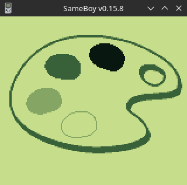

# Gameboy Examples

Hi. My name is Carlos, and this is my first experiment with Homebrew game development. I had the idea
of fork [this](https://github.com/flozz/gameboy-examples) project, 
merci [Fabien LOISON](https://github.com/flozz) 🙂

After fork it, I updated the toolchain because the original repo was out of date. I've also added my own 
opinion on the choice of tools, emulator setup for debugging, enriched the examples with explanation text, and brought 
in other examples. In the end, this repository is something completely new!

I hope you don't care to use **GNU/Linux**, but if you don't even know what this means, sorry but read this document
may be difficult to you. Besides, contributions to show the same setup in a Windows machine is embolden and more then welcome.
***Send me your patches!*** Thanks in advance.

# Install the Toolchain

<details>
  <summary>expand me...</summary>
    Its 2023, and the Gameboy Toolchain uses [SDCC](https://sdcc.sourceforge.net/) Compiler and 
    [GBDK-2020](https://github.com/gbdk-2020/gbdk-2020/releases/) cross-platform development kit.
    Please opt by download the binary released for Linux, toolchain boostrap is a difficult thing 
    out of scope of this tutorial. 

    You also will need GNU Make (install build-essential) and git.
    The packages can be installed with the following command on Debian/Ubuntu:
        
        sudo apt update
        sudo apt install build-essential git

    Clone this repository:

        git clone https://github.com/Carlos1Costa/gameboy-examples
        cd gameboy-examples

    Then you have to download the GBDK library (this needs to be done only once). Dont worry, SDCC
    will be shipped together with GBDK. Extract inside the cloned dir, the extraction will produce a dir
    called `gbdk`:

        tar -zxvf gbdk-linux64.tar.gz

    Finally, you can build examples with the `make` command from the directory of the example itself. 
    For example, if you want to build the "Hello World" example, you will have to run the following commands:

        cd 01-hello-world/
        make

    If you want to cleanup the folder from all generated files 
    (`*.rel`, `*.lst`, `*.gb`,...), you can use the following command:

        make clean

    You can now run the generated `.gb` file with our favorite emulator: [Sameboy](https://sameboy.github.io/).
</details>

# Install and Using Sameboy Emulator

<details>
  <summary>expand me...</summary>
    SameBoy is an open source Game Boy (DMG) and Game Boy Color (CGB) emulator, written in portable C. Sameboy runs in a SDL frontend for Linux, 
    and libretro as its core. It also includes a text-based debugger with an expression evaluator. Pretty good tool for the homebrew endeavour.

    To install Sameboy, download the last version from [Sameboy releases](https://github.com/LIJI32/SameBoy/releases/).
    You will need a couple of packages:

    * GCC and make (already installed)
    * SDL frontend: libsdl2 (`sudo apt install libsdl2-dev` will resolve)
    * [rgbds](https://github.com/gbdev/rgbds/releases/) for boot ROM compilation
    * [cppp](https://github.com/BR903/cppp) for cleaning up headers when compiling SameBoy as a library

    After extract the Sameboy source and fill out all the dependencies above, run
    `make` and `sudo make install` to install Sameboy. To test, call `sameboy Hello.gb` to see
    the example 01 running in the emulator.
</details>

# Examples Index (GameBoy Code)

This repository contains example programs for the Nintendo GameBoy video game console. 
The examples are originally related to this git https://github.com/flozz/gameboy-examples repository.
I have been modified and even including news since I forked the project. Have fun!


| Screenshot                                              | Name                                                       | Description                                                                  |
|---------------------------------------------------------|------------------------------------------------------------|------------------------------------------------------------------------------|
|               | [01 - Hello World](./01-hello-world/)                      | Simple program that prints "Hello World" on the screen                       |
|                 | [02 - Gamepad](./02-gamepad/)                              | Simple program shows how to use gamepad in a GameBoy program                 |
|           | [03 - Tic Tac Toe](./03-tic-tac-toe/)                      | A complete example project to show how to make a simple game for the GameBoy |
|             | [04 - Graphics 1](./04-graphics1/)                         | Simple example to show how to draw tiles on the GameBoy                      |
|             | [05 - Graphics 2](./05-graphics2/)                         | Convert an image using img2gb and display it                                 |
|  | [06 - Graphics 3 - background](./06-graphics3-background/) | Background layer scrolling example                                           |
|     | [07 - Graphics 4 - sprites](./07-graphics4-sprites/)       | A complete sprite example with an animated player                            |
|      | [08 - Graphics 5 - window](./08-graphics5-window/)         | Window layer example                                                         |
|     | [09 - Graphics 6 - palettes](./09-graphics6-palette/)      | Playing with color palettes                                                  |
|               | [10 - Breakout](./10-breakout/)                            | Simple breakout game                                                         |
|                | [11 - Custom Text](./11-custom-text/)                      | Handle and display text                                                      |


# Miscellaneous

Everything else section.

## Default Keyboard Shortcuts for the SameBoy Emulator

<details>
  <summary>expand me...</summary>
    It was really difficult for me to find the commands online, so posting here for future reference.

        Command	                Keys
        -----------------------------------------------
        Open Menu               Escape
        Open ROM                Ctrl + O
        Reset                   Ctrl + R
        Pause                   Ctrl + P
        Save state              Ctrl + (0 - 9)
        Load state              Ctrl + Shift + (0 - 9)
        Toggle Fullscreen       Ctrl + F
        Mute / Unmute           Alt + M
        Toggle audio channel    Alt + (1 - 4)
        Break Debugger          Ctrl + C

    * Button `A` and `B` are keys `z` and `x` in the keyboard, respectivelly. 
    * Button `START` is the key `enter`, button `RESET` is the `backspace` key.
    * Then you can use the directional keys as the Gameboy's direction pad.

    Textual Debugger Documentation https://sameboy.github.io/debugger/
</details>

## Building Assets

<details>
  <summary>expand me...</summary>
    Some of the examples have assets (tilesets, tilemaps, sprites,...). If you changes the images, you will have to rebuild assets.
    You will first need to install [img2gb](https://github.com/flozz/img2gb), wich is a tool to Convert Images to GameBoy Tileset and Tilemap. 
    The installation can be done with the following command:

        sudo pip install img2gb

    Then, just run the following command (from the example directory):

        make assets
</details>

# License

The examples in this repository are licensed under WTFPL unless otherwise stated:

```
        DO WHAT THE FUCK YOU WANT TO PUBLIC LICENSE
                    Version 2, December 2004

 Copyright (C) 2004 Sam Hocevar <sam@hocevar.net>

 Everyone is permitted to copy and distribute verbatim or modified
 copies of this license document, and changing it is allowed as long
 as the name is changed.

            DO WHAT THE FUCK YOU WANT TO PUBLIC LICENSE
   TERMS AND CONDITIONS FOR COPYING, DISTRIBUTION AND MODIFICATION

  0. You just DO WHAT THE FUCK YOU WANT TO.
```